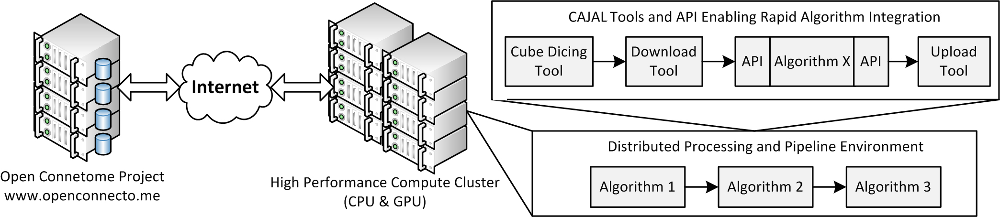

.. meta::
   :description: Official documentation for CAJAL:  Collaborative Annotation for Joint Analysis of Large Data
   :keywords: annotation, tracing, neuroscience, object detection
.. title::
   manno

.. raw:: html

	<h1>CAJAL Matlab Toolbox:  Collaborative Annotation for Joint Analysis of Large Data </h1>
	 

The CAJAL toolbox (or API) provides functionality to interact with the Open Connectome Project image and annotation databases, including querying raw image data, annotation data, and RAMON objects. Complex HTTP queries are wrapped in easy to use Matlab code - helper functions and example files are provided.  New users may wish to begin with the `Getting Started Script <_static/demoscript/demoScript.html>`_.

.. raw:: html

  

    
    
     <a href="https://github.com/openconnectome/CAJAL/zipball/master"> [ZIP]   </a>
    <a image="_static/GitHub.png" href="https://github.com/openconnectome/CAJAL/tarball/master">[TAR.GZ] </a>

  

.. sidebar:: CAJAL Contact Us

   If you have questions about CAJAL, or have data to analyze, let us know:  ocp-support@googlegroups.com

.. toctree::
   :maxdepth: 1
   :caption: Overview

   sphinx/introduction
   sphinx/local_config
   sphinx/ocp
   sphinx/faq

.. toctree::
  :maxdepth: 2
  :caption: Tutorials

  tutorials/basic_usage
  tutorials/scalable_processing
  tutorials/advanced_topics
  tutorials/queries
  tutorials/cheat_sheet
  
.. toctree::
   :maxdepth: 1
   :caption: Further Reading

   api/functions
   Gitter chatroom <https://gitter.im/openconnectome/cajal>
   Mailing List <https://groups.google.com/forum/#!forum/ocp-support/>
   Github repo <https://github.com/openconnectome/cajal>
   Release Notes <https://github.com/openconnectome/cajal/releases/>
